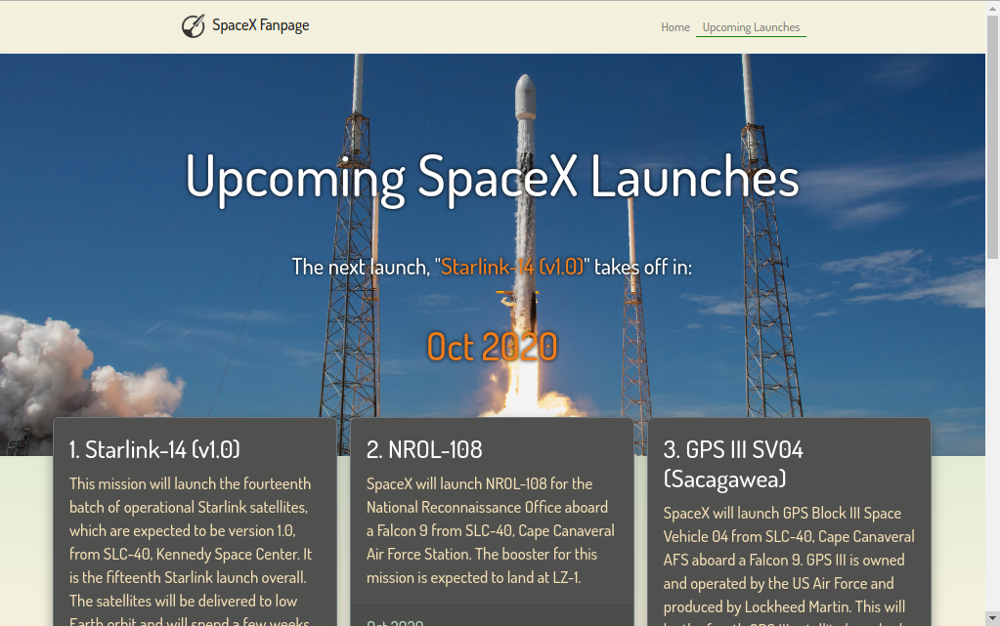

# SpaceX Fanpage

**SpaceX Fanpage** is a website that has some info about *Space Exploration Technologies Inc* (SpaceX), like upcoming launches. Up to now, August 31 2020 I've only made the Upcoming Launches page. The project itself has no backend, and it gets all the data from [https://github.com/r-spacex/SpaceX-API](https://github.com/r-spacex/SpaceX-API).

The website is currently hosted [in netlify](https://spacex-fanpage.netlify.app/upcoming).

This is a practice project where I put in practice *React, React-Bootstrap, React-Redux, Redux-Saga,*.

Just to clarify, we are not affiliated, associated, authorized, endorsed by, or in any way officially connected with Space Exploration Technologies Inc (SpaceX), or any of its subsidiaries or its affiliates. The names SpaceX as well as related names, marks, emblems and images are registered trademarks of their respective owners.